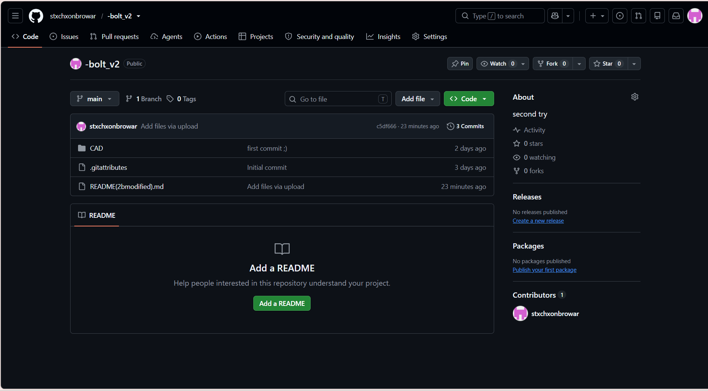
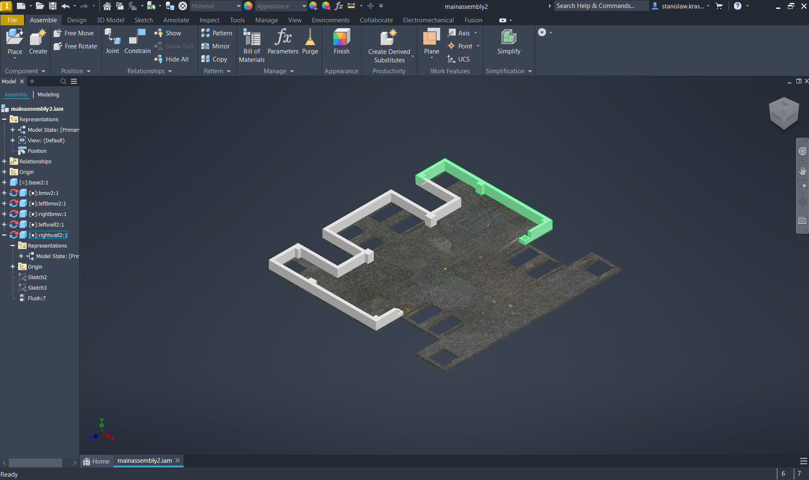

# September 7: Foldering in GitHub and start in CAD

Today I prepared my Github repository for further work. I have also created a base for my root in CAD and made first walls.

**Total time spent: 2.33 hours**