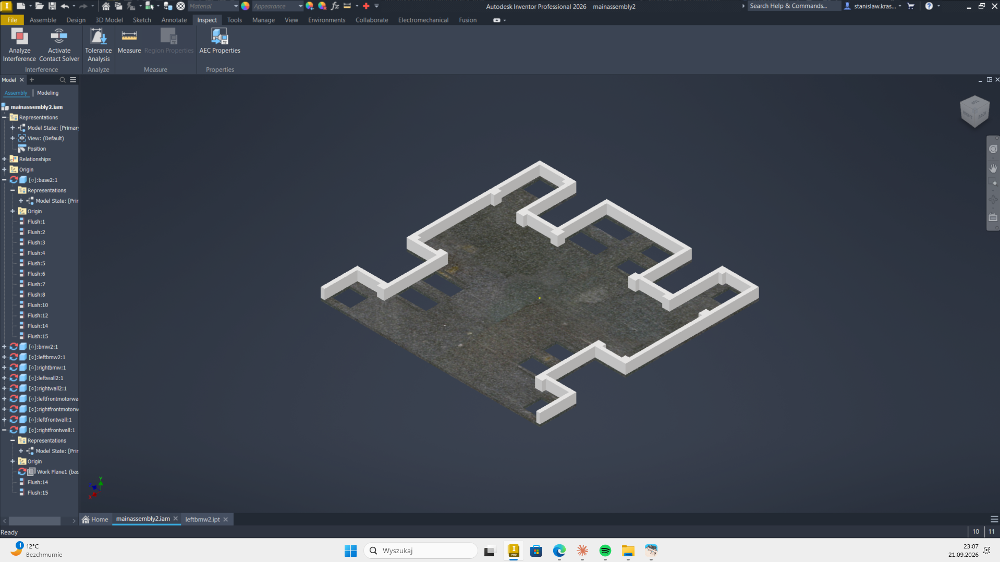
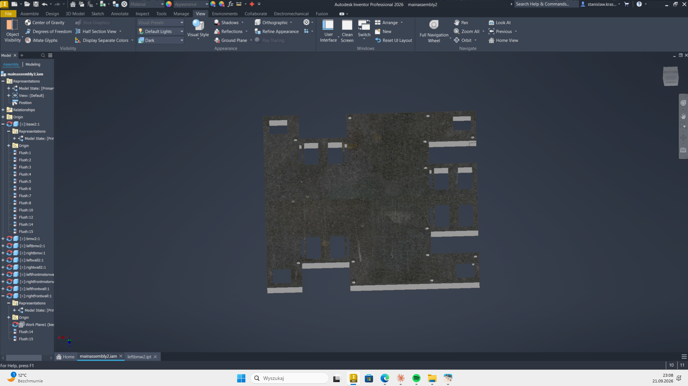
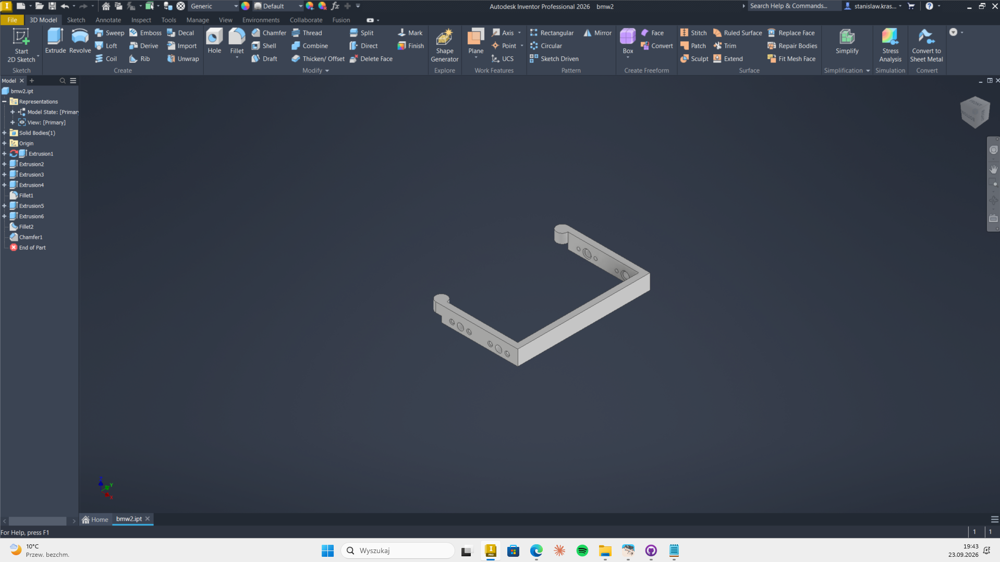
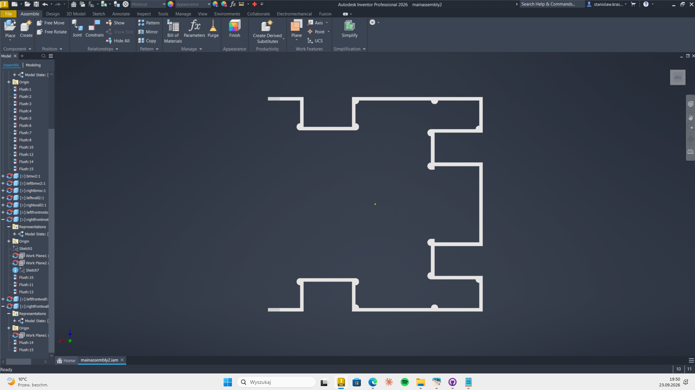

# September 7: Foldering in GitHub and start in CAD

Today I prepared my Github repository for further work. I have also created a base for my root in CAD and made first walls.

**Total time spent: 2.33 hours**

---

# September 21: Walls plus base

During this session I finished creating the raw stage of walls and made mounting holes for them in the base.

***Total time spent: 0.66 hours***

---

# September 23: Walls v2  bmwshot

This time I made some cosmetic changes to the walls and created holes for motors shafts.

***Total time spent: 0.92 hours***