# September 7: Foldering in GitHub and start in CAD

Today I prepared my Github repository for further work. I have also created a base for my root in CAD and made first walls.

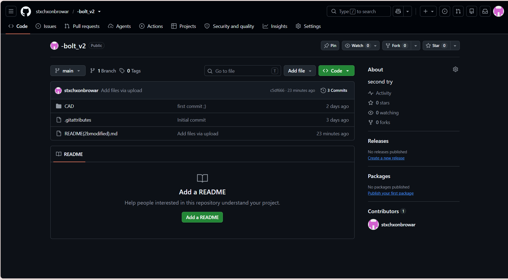
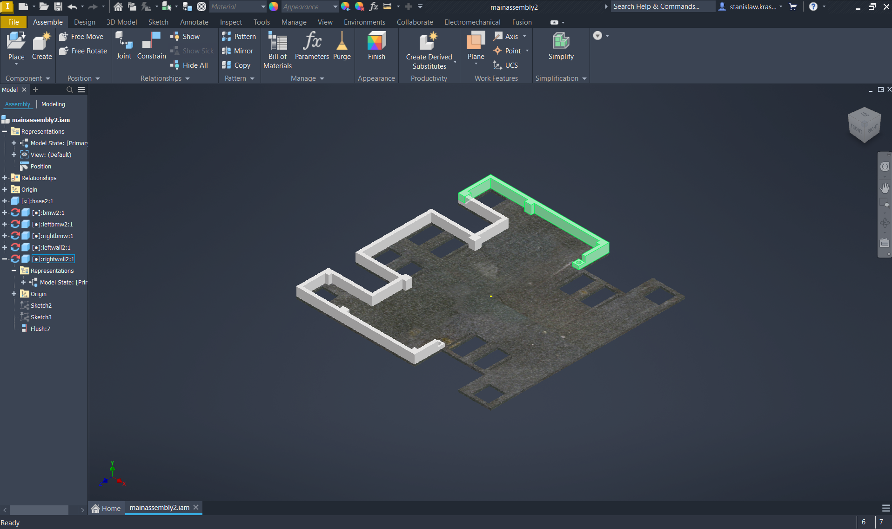

**Total time spent: 2.33 hours**

---

# September 21: Walls plus base

During this session I finished creating the raw stage of walls and made mounting holes for them in the base.

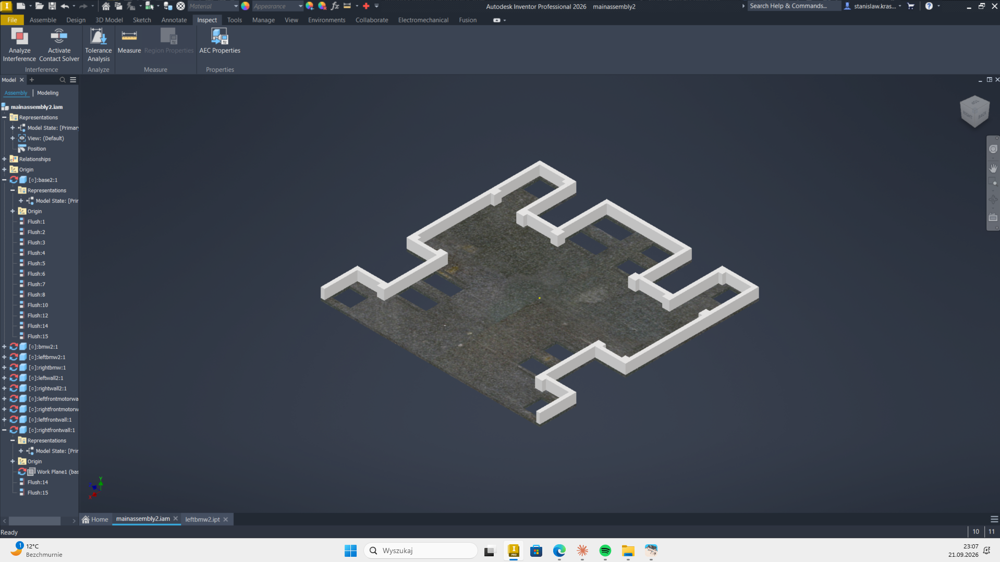
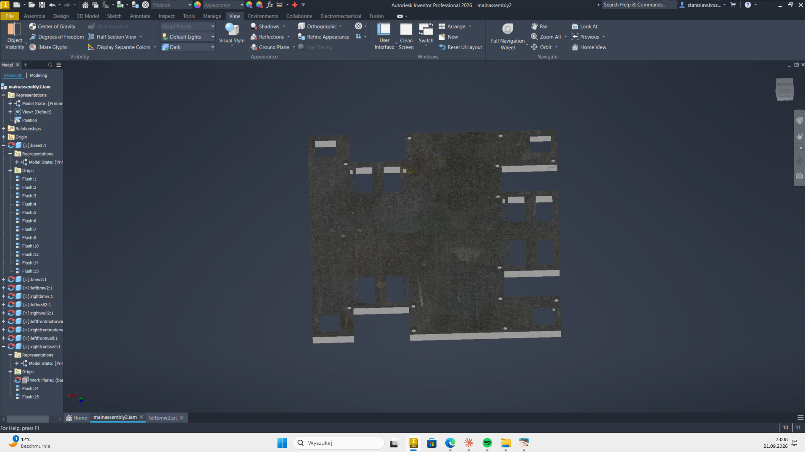

***Total time spent: 0.66 hours***

---

# September 23: Walls v2  bmwshot

This time I made some cosmetic changes to the walls and created holes for motors shafts.

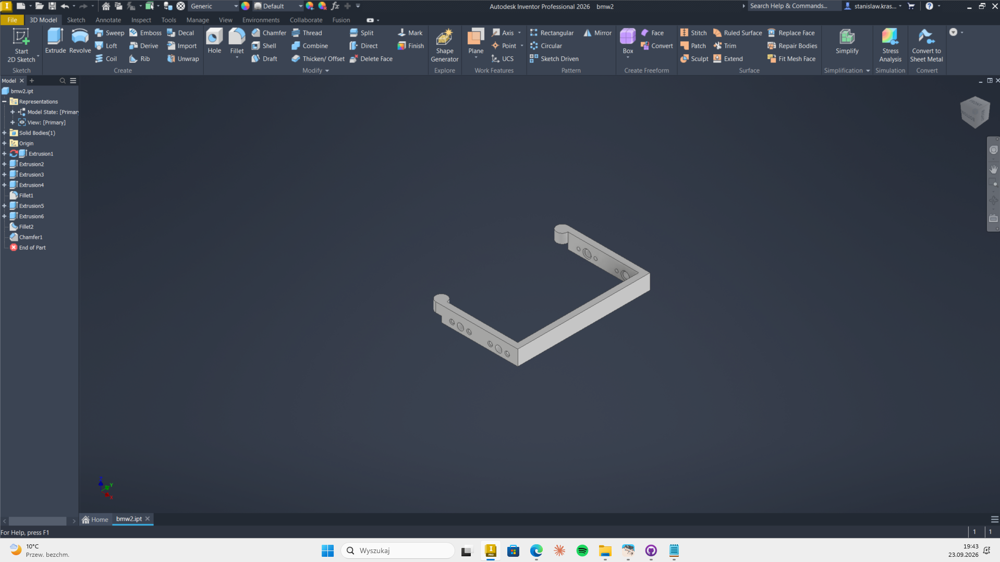
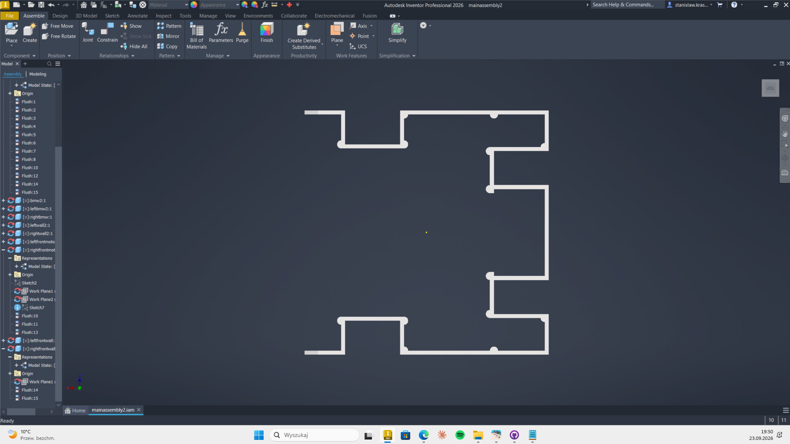

***Total time spent: 0.92 hours***

---

# September 27: Making plow assembly holder and some holes...

Today I started working on plow assembly holder. Had to make a small modifications to the base(holes for screws) and in sidewalls.
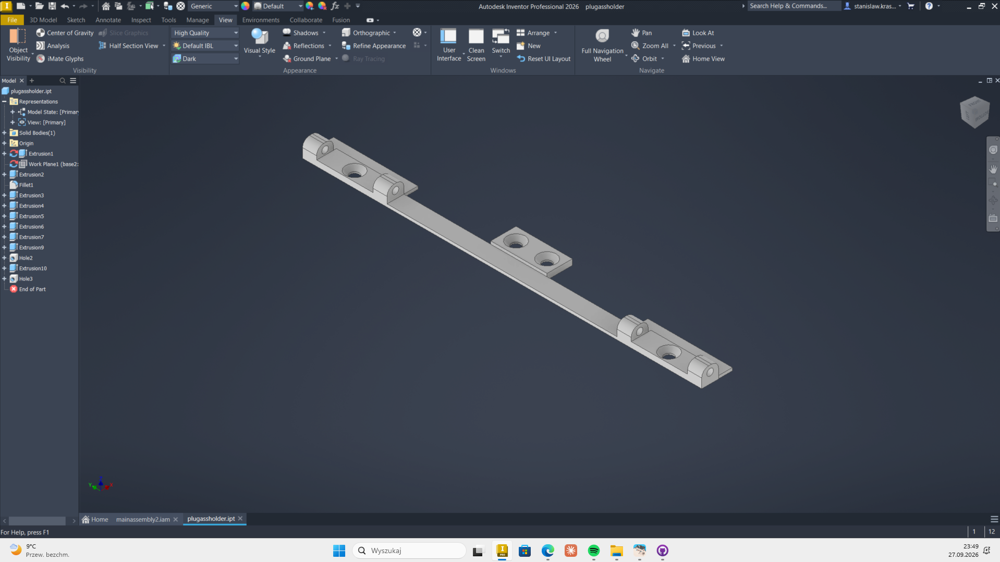
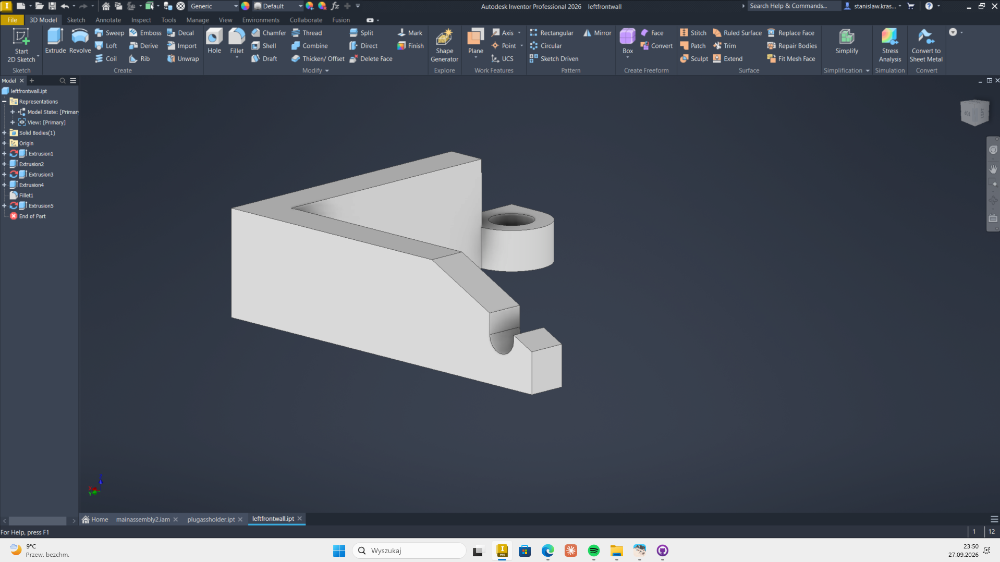

***Total time spent: 1 hour***

---

# September 28: Modifying the plowholder, making plow assembly and constrainting the main assembly

This time I started by making further modifications to the plow assembly holder, by adding a holder for vl53 that I'll be using. I have also made the plow and its holder. In the end I constrained the main assembly and added plow assembly to it(also constrained it, but in a way so it can spin freely(it simulates bumping on the dohyo)).
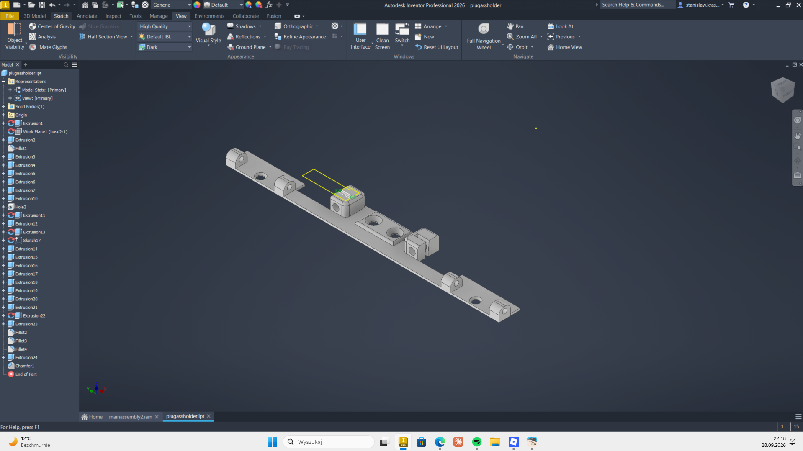
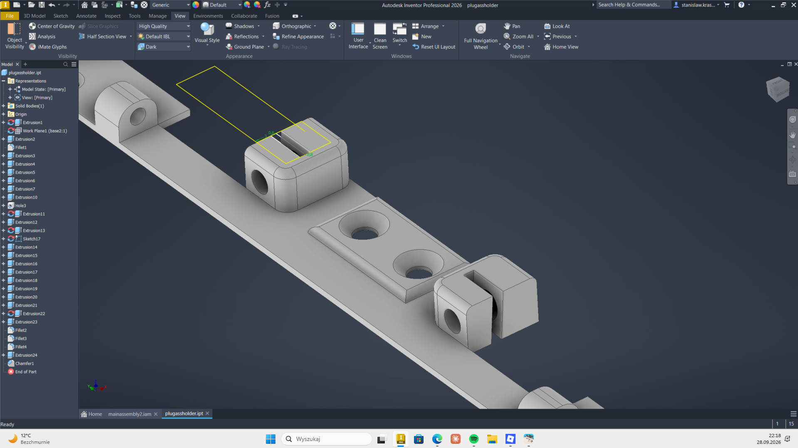
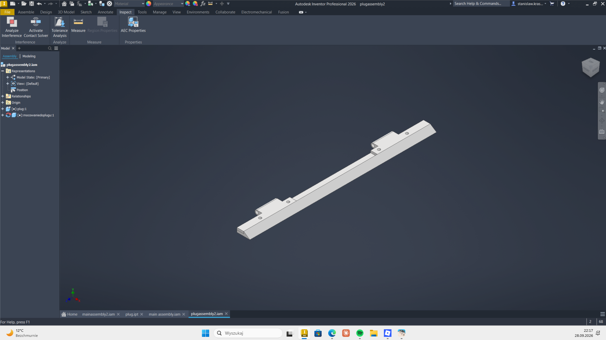
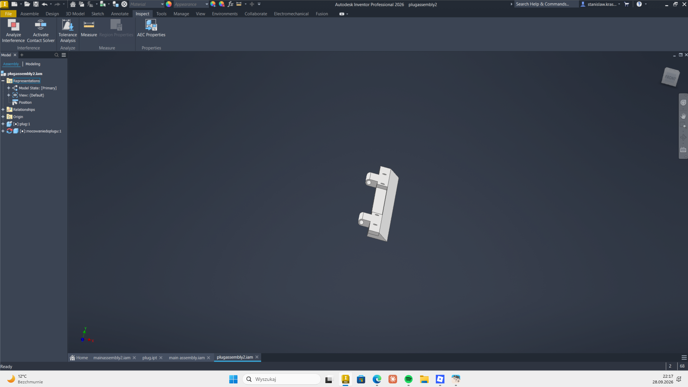

***Total time spent: 1.82 hours***